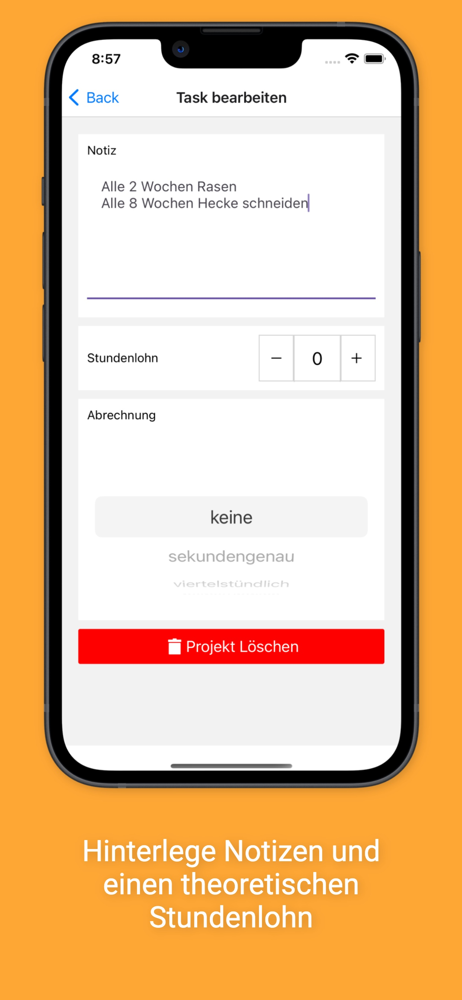

# tracky-support

tracky Projekterfassung dient der einfachen und schnellen Erfassung von Arbeitszeiten in privaten Projekten.

## Wie funktioniert's?

Um Projekte anzulegen, gib einen Namen in die Eingabe am unteren Rand ein und drücke auf "+". 
Du kannst das Projekt mit dem Stift-Symbol neben dem Titel ändern. Mit dem Play-Symbol startest du
die Zeiterfassung für das Projekt und sobald du fertig bist, drückst du auf "Stop".

## Fragen oder Probleme?

Nutze Github Issues um ein Problem zu melden oder schreibe eine Email an markoswald123@gmail.com

## Datenschutz in tracky

Alle Daten werden auf deinem Telefon gespeichert. Es werden keinerlei Daten zur Nutzung versendet.

